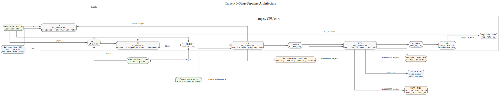

<div align="center">

[](docs/hardware/setup.md)
[](docs/hardware/setup.md)
[](riscv_pipeline_offline/riscv_pipeline_offline.srcs/sources_1/imports/src)
[](docs/architecture/instruction-set.md)
[](docs/architecture/overview.md)
[](LICENSE)

</div>

<h1 align="center">RV32IM Dual Core Pipelined RISC-V Processor</h1>

<p align="center">
  <strong>A bare-metal, FPGA-targeted RISC-V soft SoC built in SystemVerilog.</strong><br />
  Two five-stage RV32IM pipelines with a shared mailbox, UART monitor, timer/CSR support,<br />
  performance instrumentation, board peripherals, and a packed-SIMD extension.
</p>

<p align="center">
  <a href="#architecture">Architecture</a> |
  <a href="#quick-start">Quick start</a> |
  <a href="#verification-and-results">Verification &amp; results</a> |
  <a href="#documentation">Documentation</a> |
  <a href="#comparable-projects-and-references">Comparable projects</a>
</p>

<p align="center">
  <a href="docs/architecture/overview.md"><strong>Two five-stage RV32IM pipelines</strong></a> |
  <a href="docs/verification/performance.md"><strong>7,127 LUTs</strong></a> |
  <a href="docs/verification/performance.md"><strong>+5.265 ns WNS</strong></a> |
  <a href="docs/hardware/setup.md"><strong>PYNQ-Z2 target</strong></a>
</p>

---


## Highlights

| Area | Implementation |
| --- | --- |
| ISA | RV32I base integer ISA, RV32M multiply/divide, machine-mode CSRs, and five custom packed 8-bit SIMD operations |
| Microarchitecture | Two in-order, five-stage pipelines: Instruction Fetch, Decode, Execute, Memory, and Writeback |
| Pipeline control | EX/MEM and MEM/WB forwarding, load-use interlock, branch/jump flushes, and a multi-cycle divider |
| Prediction | 64-entry branch-history table using 2-bit saturating counters |
| Inter-core communication | Shared, memory-mapped bidirectional mailbox with per-core identity register |
| Debug and observability | Cycle/instruction/stall/flush counters, debug MMIO, and a four-entry commit trace buffer |
| I/O | 115200-baud UART TX/RX, terminal monitor, LED control, debounced button/switch input, and PWM output |
| Platform | AMD/Xilinx PYNQ-Z2 (`xc7z020clg400-1`), Vivado 2025.2 project included |
| Software | Bare-metal C runtime, linker script, RISC-V GCC build flow, assembly demos, and benchmark programs |
| License | [Apache License 2.0](LICENSE) |

## Project status

The RTL is simulation-verified and has been synthesized and implemented for the PYNQ-Z2 target. The latest checked-in dual-core test prints a complete mailbox handshake and ends with `DUAL-CORE COMMUNICATION VERIFIED`.

Hardware-specific claims should be read carefully: the repository contains board artifacts and constraints, but a complete, repeatable physical-board validation remains an open item. See [known issues](docs/known_issues.md) for the authoritative limitations and risks.

### Validation scope

| Scope | Current state | Evidence |
| --- | --- | --- |
| RTL simulation | Verified across pipeline, hazards, RV32M, CSRs/timer, branch prediction, SIMD, MMIO, peripherals, monitor, C programs, and mailbox flows | [Verification status](docs/verification/test-plan.md) |
| FPGA implementation | Synthesis and timing reports are checked in for the PYNQ-Z2 target | [Utilization](riscv_pipeline_offline/utilization_report.txt) and [timing](riscv_pipeline_offline/timing_report.txt) |
| Physical-board bring-up | Pending complete, repeatable validation | [Known issue / tracking](docs/known_issues.md#issue-001-physical-board-test-deferred) |

## Architecture

Each core is a classic in-order five-stage pipeline. The system wrapper supplies private instruction/data memories for the cores, shared mailbox registers, a shared UART output path, and board-facing peripherals.



### Pipeline behavior

| Stage | Responsibility | Key implementation details |
| --- | --- | --- |
| IF | Fetch and PC selection | Preloaded instruction memory with a monitor-accessible write port |
| ID | Decode and register read | RV32I/RV32M control decode, immediate generation, CSR/system control |
| EX | Execute and resolve control flow | ALU, forwarding selection, branches/jumps, packed-SIMD operations, 32-cycle restoring division |
| MEM | Data access and peripherals | Byte-enable RAM accesses, MMIO decode, UART, timer, counters, debug trace, mailbox, and board peripherals |
| WB | Commit result | Selects memory or execution result and writes the integer register file |

The design forwards results from EX/MEM and MEM/WB where possible. A dependent instruction immediately after a load is stalled, while control-flow redirects flush younger work. `DIV`, `DIVU`, `REM`, and `REMU` use an iterative Execute-stage state machine rather than a long combinational divide path, preserving timing closure.

### ISA support

The core supports the full RV32I instruction set, RV32M multiply/divide instructions, CSR read-modify-write instructions, `MRET`, timer interrupts, and `ECALL`/`EBREAK`/illegal-instruction trap handling. `FENCE` and `FENCE.I` are decoded as no-operations because this implementation has no cache hierarchy.

The custom packed-SIMD instructions use the standard RISC-V `custom-0` opcode space and operate independently on four unsigned 8-bit lanes:

| Instruction | Operation |
| --- | --- |
| `PADD8` | Packed byte addition (wrapping) |
| `PSUB8` | Packed byte subtraction (wrapping) |
| `PMAXU8` | Per-lane unsigned maximum |
| `PMINU8` | Per-lane unsigned minimum |
| `PAVG8` | Per-lane unsigned average, rounded down |

For encodings, supported-instruction details, and deliberate omissions, see the [instruction-set matrix](docs/architecture/instruction-set.md).

### Memory and peripherals

The Memory stage uses an internal signal-bundle bus to isolate RAM and MMIO peripherals. The full register-level contract is in the [memory map](docs/architecture/memory-map.md).

| Address | Block | Purpose |
| --- | --- | --- |
| `0x0000_0000` region | Data RAM | Core-local data memory |
| `0x8000_0000` to `0x8000_0008` | UART | Status, TX byte, RX byte |
| `0xC000_0000` to `0xC000_000C` | Performance | Cycle, retired-instruction, stall, and flush counters |
| `0xC000_0010` to `0xC000_007F` | Debug | Current/committed/fault state and commit trace buffer |
| `0xC000_0200` to `0xC000_0208` | Timer | `mtime`, `mtimecmp`, enable/pending control |
| `0xC000_0410` | Core ID | Read-only hardware core identifier |
| `0xC000_0500` to `0xC000_050C` | Mailbox | Bidirectional data and flags between Core 0 and Core 1 |
| `0xD000_0000` to `0xD000_0010` | Board peripherals | LED, button/switch, PWM period/duty/control |

### UART monitor

At reset, the monitor owns the physical UART and keeps the processor in reset. It accepts `help`, `load`, `run`, `reset`, `regs`, `mem`, `perf`, and `trace`; `!!!` returns a running system to monitor mode. The [UART monitor reference](docs/architecture/uart-monitor.md) documents every command, wire-up, and loader mode.

## Repository layout

```text
.
├── riscv_pipeline_offline/    # Vivado project, SystemVerilog RTL, constraints, testbenches
├── sw/                        # Bare-metal C runtime, linker script, demos, benchmarks
├── asm/                       # Assembly demos and generated .mem images
├── tests/expected/            # Golden memory images for software regression
├── results/                   # Checked-in simulation, benchmark, synthesis, and board artifacts
├── tools/                     # Regression, loader, and documentation helper scripts
├── Docs/                      # Architecture, hardware, verification, decisions, and guides
├── run_build.tcl              # Vivado full build entry point
└── run_synthesis.tcl          # Vivado synthesis-only entry point
```

The primary RTL lives in [`riscv_pipeline_offline/.../src`](riscv_pipeline_offline/riscv_pipeline_offline.srcs/sources_1/imports/src). Start with [`top.sv`](riscv_pipeline_offline/riscv_pipeline_offline.srcs/sources_1/imports/src/top.sv), [`dual_core_top.sv`](riscv_pipeline_offline/riscv_pipeline_offline.srcs/sources_1/imports/src/dual_core_top.sv), and [`fpga_top.sv`](riscv_pipeline_offline/riscv_pipeline_offline.srcs/sources_1/imports/src/fpga_top.sv).

## Quick start

### Prerequisites

- AMD/Xilinx Vivado 2025.2 (the checked-in reports were generated with this version)
- A RISC-V bare-metal GNU toolchain providing `riscv-none-elf-gcc`, `objcopy`, and `objdump`
- Python 3; install `pyserial` only for direct serial loading
- A PYNQ-Z2 and a UART terminal, for physical hardware work

### Open or build the FPGA project

Open `riscv_pipeline_offline/riscv_pipeline_offline.xpr` in Vivado, or execute one of the root TCL scripts from Vivado's Tcl console:

```tcl
source run_synthesis.tcl  ;# Synthesis only
source run_build.tcl      ;# Synthesis, implementation, and bitstream flow
```

Board pin assignments, serial wiring, and bring-up procedure are documented in the [hardware setup guide](docs/hardware/setup.md). Before programming hardware, also use the [board-arrival checklist](docs/board_arrival_checklist.md).

### Build a bare-metal program

The software Makefile compiles a selected C demo, disassembles it, and converts the binary to the word-oriented `.mem` format used by the instruction loader.

```powershell
cd sw
make TARGET=hello_world
make TARGET=matmul
make TARGET=string_match
```

Available sources include `hello_world`, `fibonacci_rec`, `matmul`, `primes`, `string_match`, and `string_match_interactive`; benchmark sources cover scalar/SIMD checksums and branch sorting. The resulting `TARGET.mem` can be used by the simulation flow or transmitted through the monitor.

### Load through UART

With the board connected at 115200 baud, generate and send monitor commands with:

```powershell
pip install pyserial
python tools/mem_to_load_commands.py sw/hello_world.mem -f interactive --port COM3 --baud 115200
```

Replace `COM3` with the host serial port. The loader supports raw text, UART byte-stream, and interactive modes; see the [monitor documentation](docs/architecture/uart-monitor.md#host-side-loader).

## Verification and results

### Checked-in evidence

| Result | Outcome | Evidence |
| --- | --- | --- |
| Verification suite | 33 passing checks, 0 failures, 2 deferred hardware/tooling checks | [Verification status](docs/verification/test-plan.md) |
| Pipeline / UART / performance regression | Pass | [Final regression artifact](results/final_clean_regression.txt) |
| Branch predictor | 64-entry BHT verified; `branch_sort` measured 20,613 cycles with 65 flushes | [CPI metrics](results/phase8_cpi_metrics.txt) and [benchmark summary](results/phase10_benchmark_report.md) |
| Custom SIMD | 9/9 directed tests passed | [Phase 9 clean result](results/final_clean_phase9.txt) |
| SIMD throughput | Checksum: 1,542 scalar cycles vs. 400 packed-SIMD cycles (**3.85x** cycle speedup) | [Detailed benchmark report](results/phase10_benchmark_report.md) |
| MMIO bus | RAM, UART isolation, counters, timer, debug, and unmapped-address test passed | [Test plan entry](docs/verification/test-plan.md#phase-11-tests) |
| Board peripherals | 9/9 LED, button/switch, and PWM tests passed in simulation | [Phase 12 clean result](results/final_clean_phase12.txt) |
| Dual-core mailbox | Bidirectional mailbox handshake passed | [Phase 13 simulation log](results/phase13_sim_results.txt) and [concise proof output](results/board_phase13_proof.txt) |
| FPGA implementation | 7,127 LUTs (13.4%), 1,737 registers (1.63%), 1 BRAM (0.71%), 0 DSPs; reported WNS +5.265 ns | [Performance history](docs/verification/performance.md), [utilization report](riscv_pipeline_offline/utilization_report.txt), and [timing report](riscv_pipeline_offline/timing_report.txt) |

These figures are project-specific measurements, not a normalized comparison with other cores: clock, FPGA family, memory configuration, tool version, and benchmark methodology all affect them.

### Reproducing simulation

The Vivado project contains self-checking testbenches for the core, traps/CSRs, RV32M operations, branch predictor, memory map, C programs, monitor, peripherals, and dual-core mailboxes. Project TCL runners are located in `riscv_pipeline_offline/` and at the repository root; useful entry points include:

```text
riscv_pipeline_offline/run_tb_phase5.tcl       # CSRs, traps, timer IRQ
riscv_pipeline_offline/run_tb_phase9.tcl       # packed-SIMD
riscv_pipeline_offline/run_tb_phase12.tcl      # board peripherals
riscv_pipeline_offline/run_tb_phase13.tcl      # dual-core mailbox
riscv_pipeline_offline/run_tb_fpga_top.tcl     # UART monitor / FPGA wrapper
tools/run_all_sims.ps1                         # regression helper
```

Use the [test plan](docs/verification/test-plan.md) as the authoritative test inventory and the [`results/`](results) directory as the preserved output record.

## Design constraints and known limitations

- **Misaligned accesses are unsupported.** Halfword and word accesses must be naturally aligned; misaligned addresses are truncated rather than raising an architectural misalignment exception.
- **UART software must poll TX busy.** A byte written while the transmitter is busy can be dropped; existing UART helpers use busy polling.
- **Physical-board verification is incomplete.** Treat simulation and implementation reports as evidence of RTL correctness and timing closure, not a substitute for full board qualification.
- **No cache or virtual-memory system.** `FENCE`/`FENCE.I` are no-ops, and the system is intended for small, bare-metal workloads.

See [known issues](docs/known_issues.md), [architecture decisions](docs/decisions/README.md), and the [roadmap](docs/roadmap.md) for context and planned work.

## Documentation

| Need | Link |
| --- | --- |
| Full design and module guide | [Architecture overview](docs/architecture/overview.md) |
| Instructions and custom extension | [Instruction-set matrix](docs/architecture/instruction-set.md) |
| Registers and address decoding | [Memory map](docs/architecture/memory-map.md) |
| UART monitor commands and host loader | [UART monitor reference](docs/architecture/uart-monitor.md) |
| FPGA wiring and build notes | [Hardware setup](docs/hardware/setup.md) |
| Test coverage and status | [Verification status](docs/verification/test-plan.md) |
| Benchmarks, resources, and timing history | [Performance history](docs/verification/performance.md) |
| All project documentation | [Documentation index](docs/README.md) |

## Comparable projects and references

This project is primarily a learning/research and FPGA-integration design: it prioritizes visible pipeline mechanics, custom extensions, and a compact board-level SoC over the configurability, verification maturity, or minimum-area focus of production-quality alternatives. The links below are useful reference points, not claims of benchmark equivalence.

| Project / reference | Why it is relevant | Useful links |
| --- | --- | --- |
| **PicoRV32** | A compact, configurable RV32 core; helpful contrast with this repository's pipelined design. Its upstream README includes Xilinx 7-series size/frequency figures, CPI tables, interfaces, tests, and a PicoSoC example. | [Repository](https://github.com/YosysHQ/picorv32), [performance and CPI section](https://github.com/YosysHQ/picorv32#cycles-per-instruction-performance), and [Xilinx 7-series evaluation](https://github.com/YosysHQ/picorv32#evaluation-timing-and-utilization-on-xilinx-7-series-fpgas) |
| **VexRiscv** | A configurable, FPGA-focused RV32 processor generated with SpinalHDL. A strong reference for configurable pipelines, cache options, and published configuration-level performance figures. | [Repository](https://github.com/SpinalHDL/VexRiscv), [CPU configurations and performance](https://github.com/SpinalHDL/VexRiscv#cpu-configurations), and [Murax SoC examples](https://github.com/SpinalHDL/VexRiscv#murax) |
| **Ibex** | A security-conscious 32-bit in-order core widely used as a verification and integration reference. Its repository documents supported configurations, verification infrastructure, and demo systems. | [Repository](https://github.com/lowRISC/ibex), [documentation](https://ibex-core.readthedocs.io/en/latest/), and [demo system](https://github.com/lowRISC/ibex-demo-system) |
| **NEORV32** | A self-contained MCU-style RISC-V SoC in VHDL with extensive documentation, software framework, and FPGA-oriented examples. Useful when comparing peripheral-rich soft SoC integration approaches. | [Repository](https://github.com/stnolting/neorv32), [documentation](https://stnolting.github.io/neorv32/), and [processor checklist](https://stnolting.github.io/neorv32/#_neorv32_processor_checklist) |
| **SERV** | A bit-serial RV32I core optimized for tiny FPGA/ASIC area. It provides the opposite design point to this throughput-oriented five-stage pipeline. | [Repository](https://github.com/olofk/serv), [documentation](https://serv.readthedocs.io/), and [results](https://serv.readthedocs.io/en/latest/results.html) |
| **RISC-V ISA specifications** | The normative source for the base ISA, standard extensions, privileged architecture, and custom opcode-space rules used by this project. | [Unprivileged ISA specification](https://docs.riscv.org/reference/isa/unpriv/unpriv-index.html) and [Privileged architecture specification](https://docs.riscv.org/reference/isa/priv/priv-index.html) |

## Contributing

Keep RTL, tests, and documents consistent. For a non-trivial change, update the relevant architecture and verification pages, preserve a result artifact where practical, and record unresolved risks in [known issues](docs/known_issues.md). The repository history and [change log](CHANGELOG.md) provide additional project context.

## License

This project is licensed under the [Apache License 2.0](LICENSE).
