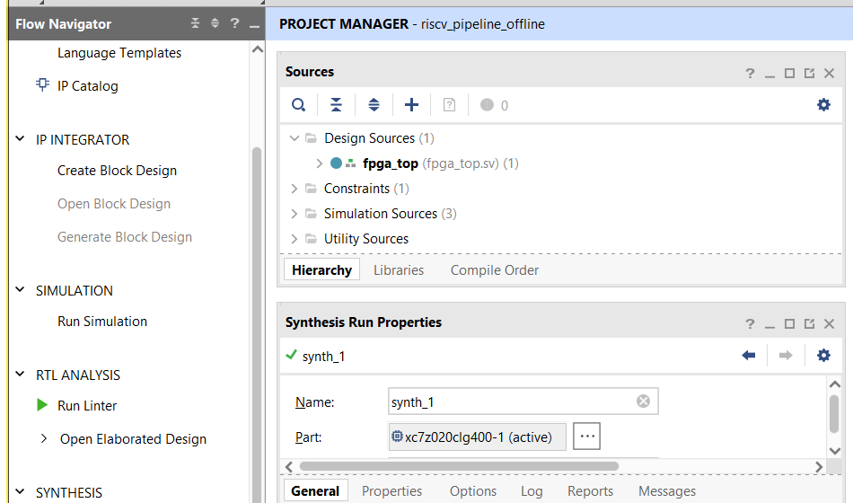
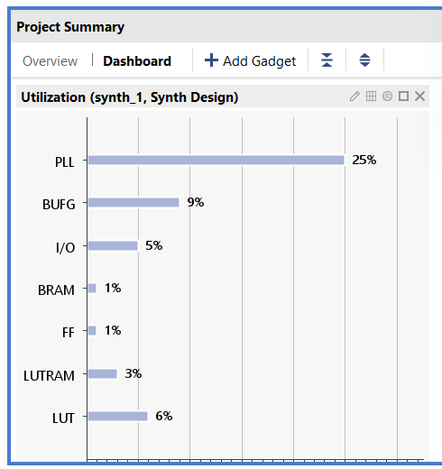
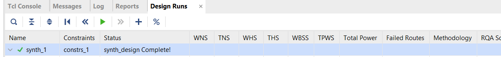

# RISC-V Pipeline for PYNQ Z2

This repository contains a 32-bit RV32I 5-stage pipelined processor written in SystemVerilog, along with a self-checking Vivado simulation flow and an FPGA wrapper for the PYNQ Z2 (`xc7z020clg400-1`).

The public repo intentionally keeps only the hand-maintained project sources. Vivado-generated builds, logs, caches, local docs, and machine-specific files are not committed.

## Project Layout

- `src/`: processor RTL and the `fpga_top` board wrapper
- `sim/`: self-checking testbench for Vivado xsim
- `constraints/`: PYNQ Z2 pin constraints
- `mem/`: sample program image
- `scripts/`: offline Vivado build flow

## Vivado Screenshots

### Project Manager



### Project Summary



### Design Run Status



## Offline Vivado Flow

Run the full offline bring-up from PowerShell:

```powershell
.\scripts\run_offline_bringup.ps1
```

Or call Vivado directly:

```powershell
& "C:\AMDDesignTools\2025.2\Vivado\bin\vivado.bat" -mode batch -source scripts\run_offline_bringup.tcl
```

The flow performs:

- behavioral simulation with the bundled testbench
- synthesis for `fpga_top`
- implementation and timing checks
- DRC and power reports
- bitstream generation

Generated outputs are written under `build/vivado_offline/` on the local machine and are intentionally excluded from git.

## Expected Hardware Behavior

The PYNQ Z2 wrapper drives four LEDs:

- `led[0]`: heartbeat
- `led[1]`: CPU running
- `led[2]`: pass
- `led[3]`: fail

After the board is connected, program the generated bitstream in Vivado Hardware Manager, press `BTN0`, and confirm the LED behavior above.
